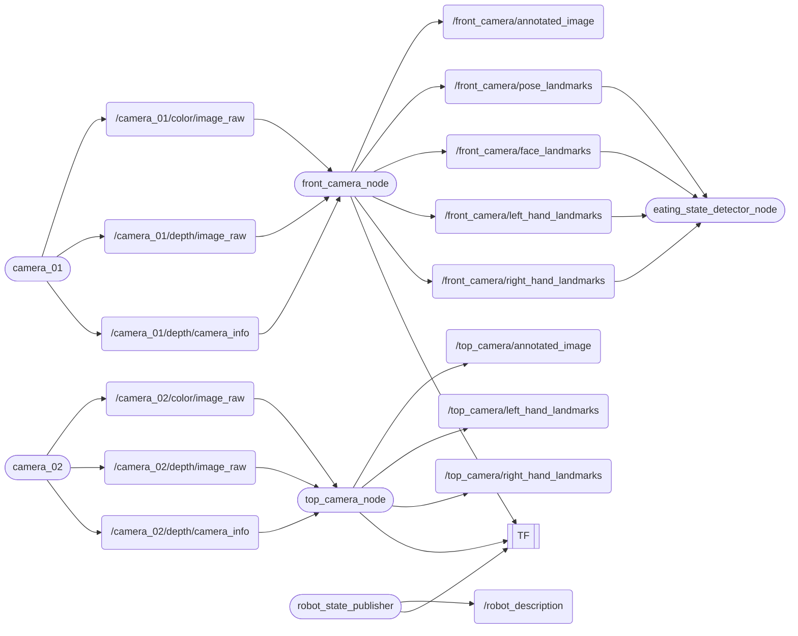
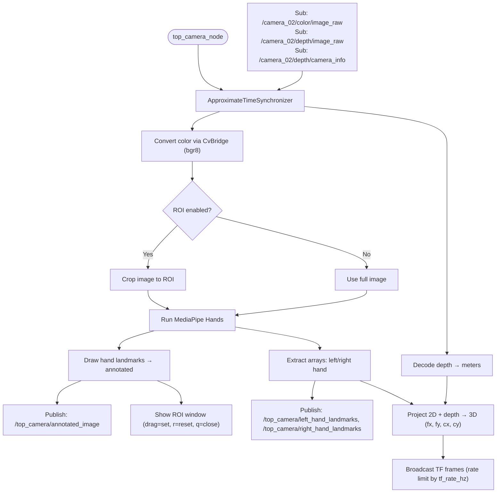
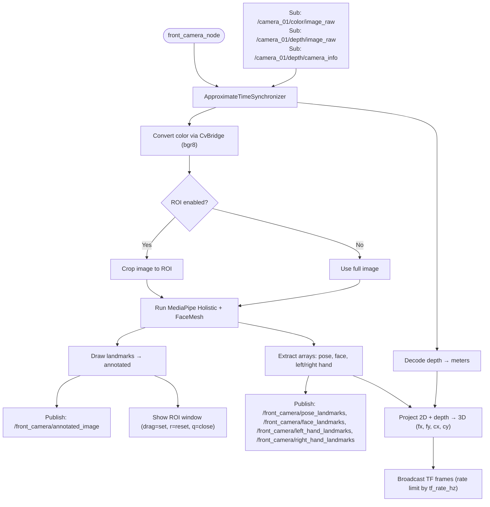
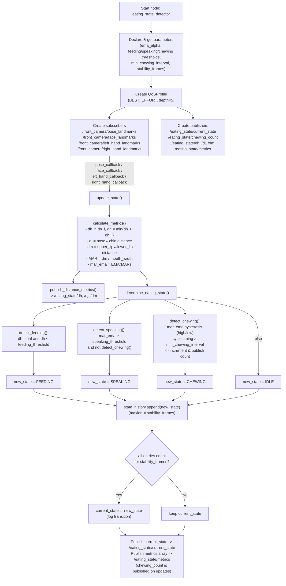

# cibo
[](https://docs.ros.org/en/humble/)

## 🚀 Overview
- Estimating human skeletal structure while eating.
- Estimating a person's state during meals.

## 📦 Feature
### Nodes & Topics

### Flowchart
front_camera_depth_node

front_camera_depth_node

Chewing Count Node



## 🛠️ Setup
### Setup Camera ([Astra Stereo S U3](https://store.orbbec.com/products/astra-stereo-s-u3?srsltid=AfmBOop-7Cnl_FU8fo6iytP43uBmOZTonKg5eosq_w3jRvFCeXtigKCG))

Please follow link  
[OrbbecSDK_ROS2](https://github.com/orbbec/OrbbecSDK_ROS2.git)
> [!IMPORTANT]
> branch: `main`  
> Use the `main` branch instead of the default `v2-main`  
> デフォルトの`v2-main`は使用しないで，`main` branchを使用する  
> 2025-10-14

### Installing dependent packages
Install python packages
```bash
pip3 install -U "numpy==1.26.4" "opencv-python==4.10.0.84"
pip3 install opencv-python mediapipe
```
Install ros packages
```bash
sudo apt install ros-${ROS_DISTRO}-cv-bridge
sudo apt install ros-${ROS_DISTRO}-image-transport
sudo apt install ros-${ROS_DISTRO}-message-filters
sudo apt install ros-${ROS_DISTRO}-ffmpeg-image-transport
sudo apt install ros-${ROS_DISTRO}-ffmpeg-image-transport-tools
```
### Setup cibo Repositories
Clone
```bash
$ cd ~/ros2_ws/src
$ git clone https://github.com/iHaruruki/cibo.git
```
Build
```bash
$ cd ~/ros2_ws
$ colcon build --symlink-install --packages-select cibo
$ source install/setup.bash
```

## 🎮 How to use
### Build
```bash
cd ~/ros2_ws
colcon build --symlink-install --packages-select cibo
source install/setup.bash
```
### Camera launch
Run camera
```bash
ros2 launch orbbec_camera multi_camera.launch.py
```
Check the camera connection. / カメラの接続を確認する．
```bash
ros2 launch cibo rviz.launch.py
```
View images on rviz2 / rviz2上で画像を確認  

- Is the Front-Camera video being output to the `Front_camra` window?  
    `Front_camra`ウィンドウにFront-Camera映像が出力されているか
- Is the Top-Camera video being output to the `Top_camera` window?  
    `Top_camera`ウィンドウにTop-Camera映像が出力されているか

> [!TIP]
> When the camera connection fails and the Front-Camera/Top-Camera positions are reversed.  
> カメラの接続に失敗した場合 & Front-Camera/Top-Cameraの位置関係が逆の場合  
> [Multi-Camera](https://github.com/orbbec/OrbbecSDK_ROS2/tree/main?tab=readme-ov-file#multi-camera)  
> Please follow bellow.

- To get the `usb_port` of the camera, plug in the camera and run the following command in the terminal:  
カメラの `usb_port` を取得するには，カメラのUSB端子をNUCに接続し，ターミナルで次のコマンドを実行します．
```bash
ros2 run orbbec_camera list_devices_node
```
Result（usb port 結果が表示される）
```bash
ros2 run orbbec_camera list_devices_node 
[10/14 22:55:59.986415][info][7139][Context.cpp:68] Context created with config: default config!
[10/14 22:55:59.986426][info][7139][Context.cpp:73] Work directory=/home/#######/ros2_ws, SDK version=v1.10.27-20250925-0549823
[10/14 22:55:59.986459][info][7139][LinuxPal.cpp:32] createObPal: create LinuxPal!
[10/14 22:56:00.340029][warning][7139][OpenNIDeviceInfo.cpp:190] New openni device matched.
[10/14 22:56:00.340040][warning][7139][OpenNIDeviceInfo.cpp:190] New openni device matched.
[10/14 22:56:00.340145][info][7139][LinuxPal.cpp:166] Create PollingDeviceWatcher!
[10/14 22:56:00.340186][info][7139][DeviceManager.cpp:15] Current found device(s): (2)
[10/14 22:56:00.340190][info][7139][DeviceManager.cpp:24] 	- Name: SV1301S_U3, PID: 0x0614, SN/ID: , Connection: USB3.0
[10/14 22:56:00.340192][info][7139][DeviceManager.cpp:24] 	- Name: SV1301S_U3, PID: 0x0614, SN/ID: , Connection: USB3.0
[INFO] [1760450160.382261914] [list_device_node]: serial: AY0F7010783
[INFO] [1760450160.382286638] [list_device_node]: usb port: 2-3.2 #check!
[INFO] [1760450160.424122696] [list_device_node]: serial: AY0F7010108
[INFO] [1760450160.424135464] [list_device_node]: usb port: 2-4.2 #check!
```
- Rewrite the camera launch file. / カメラのLaunchファイルを書き換える．  
`ros2_ws/src/OrbbecSDK_ROS2/orbbec_camera/launch/multi_camera.launch.py`
```python
from launch import LaunchDescription
from launch.actions import DeclareLaunchArgument, IncludeLaunchDescription, GroupAction, ExecuteProcess
from launch.launch_description_sources import PythonLaunchDescriptionSource
from launch_ros.actions import Node
from ament_index_python.packages import get_package_share_directory
import os


def generate_launch_description():
    # Include launch files
    package_dir = get_package_share_directory('orbbec_camera')
    launch_file_dir = os.path.join(package_dir, 'launch')
    launch1_include = IncludeLaunchDescription(
        PythonLaunchDescriptionSource(
            os.path.join(launch_file_dir, 'astra_stereo_u3.launch.py')  # replace your camera launch file
        ),
        launch_arguments={
            'camera_name': 'camera_01',
            'usb_port': '2-3.2',    # replace your front camera usb port here
            'device_num': '2',
            'sync_mode': 'standalone'
        }.items()
    )

    launch2_include = IncludeLaunchDescription(
        PythonLaunchDescriptionSource(
            os.path.join(launch_file_dir, 'astra_stereo_u3.launch.py')  # replace your camera launch file
        ),
        launch_arguments={
            'camera_name': 'camera_02',
            'usb_port': '2-4.2',    # replace your top camera usb port here
            'device_num': '2',
            'sync_mode': 'standalone'
        }.items()
    )

    # If you need more cameras, just add more launch_include here, and change the usb_port and device_num

    # Launch description
    ld = LaunchDescription([
        GroupAction([launch1_include]),
        GroupAction([launch2_include]),
    ])

    return ld
```

- Build
```bash
cd ~/ros2_ws
colcon build --symlink-install --packages-select orbbec_camera
```
- Camera connection check!  
[Run camera](#Camera-launch)

### Launch Cibo
```bash
ros2 launch cibo cibo_depth.launch.py
```
How to Select an ROI (Specify the area for skeleton estimation) / ROI選択方法（骨格推定を行う範囲を指定する）
1. After launching the node, the OpenCV window will appear.  
    ノード起動後，OpenCVウィンドウが表示されます
2. Drag the mouse to specify the area for skeleton estimation.  
    マウスをドラッグして骨格推定を行う範囲を指定します
3. A blue rectangle will appear while you drag, and a green rectangle will appear after you confirm.  
    ドラッグ中は青い矩形が表示され，確定後は緑の矩形で表示されます

### View the output image.(OpenCV Image Show) / 出力画像を見る
```bash
ros2 run cibo image_show_node
```
### Run chewing count node
```bash
ros2 run cibo chew_counter_node
```
> [!WARNING]
> `ros2 run cibo chew_counter_node`  
> It may not function properly as it is currently being adjusted.  
> 調整中のため，正常に動作しない．

### Run eating state node 
```bash
ros2 run cibo eating_state_detector_node
```
> [!WARNING]
> `ros2 run cibo chew_counter_node`  
> It may not function properly as it is currently being adjusted.  
> 調整中のため，正常に動作しない．

### [rosbag](https://docs.ros.org/en/humble/Tutorials/Beginner-CLI-Tools/Recording-And-Playing-Back-Data/Recording-And-Playing-Back-Data.html)
If you want to record images, use rosbg. / 画像を録画したい場合は，rosbagを利用
```bash
# make bag_files directory
cd ~/ros2_ws/bag_files
# If you have created it, use `mkdir bag_files`
```
Recode all topic / すべてのトピックを記録する
```bash
ros2 bag record -a
# This command is mode that record all topic.
```
Recode only specific topics / 特定のトピックのみ記録する
```bash
# ros2 bag record --topics <topic_name_1> <topic_name_2> <topic_name_3>
ros2 bag record --topics /camera_01/color/image_raw /camera_01/depth/image_raw /camera_02/color/image_raw /camera_02/depth/image_raw
```
> [!WARNING]
> Due to the large data size, be mindful of your available storage space!  
> データサイズが大きいため，ストレージの空き容量に注意！


## 🚀 Node List

### front_camera_node
- **Function**: Skeletal estimation node for the front camera. Performs detailed facial analysis using the Face Mesh model. / フロントカメラ用の骨格推定ノード．Face Meshモデルによる詳細な顔解析を実行．

### top_camera_node  
- **Function**: Skeleton estimation node for top cameras. Specialized for pose and hand detection. / トップカメラ用の骨格推定ノード．ポーズと手の検出に特化．

### chew_counter_node
- **Function**: Counting chews / 咀嚼回数をカウントする．
- [methods](documents/chewing_count.md)

## eating_state_detection
**Function**: State estimation / 状態推定
- [methods](documents/chewing_count.md)

## 📦 Parameter List ([ROS 2 params](https://docs.ros.org/en/humble/Concepts/Basic/About-Parameters.html))

### front_camera_node
| Parameter | Type | Default value | Description |
|-----------|------|---------------|-------------|
| `enable_roi` | bool | true | Enable ROI (Region of Interest) |
| `roi_x` | int | 0 | ROI start X coordinate |
| `roi_y` | int | 0 | ROI start Y coordinate |
| `roi_width` | int | 400 | ROI width |
| `roi_height` | int | 300 | High ROI |
| `min_detection_confidence` | double | 0.5 | Minimum confidence level for detection |
| `min_tracking_confidence` | double | 0.5 | Minimum confidence level for tracking |
| `enable_iris` | bool | true | Enable iris detection |
| `refine_landmarks` | bool | true | Enable detailed facial landmarks |

### top_camera_node
| Parameter | Type | Default value | Description |
|-----------|------|---------------|-------------|
| `enable_roi` | bool | true | Enable ROI (Region of Interest) |
| `roi_x` | int | 0 | ROI start X coordinate |
| `roi_y` | int | 0 | ROI start Y coordinate |
| `roi_width` | int | 400 | ROI width |
| `roi_height` | int | 300 | High ROI |
| `min_detection_confidence` | double | 0.5 | Minimum confidence level for detection |
| `min_tracking_confidence` | double | 0.5 | Minimum confidence level for tracking |

## 👤 Authors
- **[iHaruruki](https://github.com/iHaruruki)** — Main author & maintainer

## 📚 Reference
ROS2
- [ROS 2-Humble](https://docs.ros.org/en/humble/index.html)
- [ROS 2 Installation](https://docs.ros.org/en/humble/Installation/Ubuntu-Install-Debs.html)

Mediapipe Face Mesh
- [MediaPipe](https://chuoling.github.io/mediapipe/)
- [Face landmark detection guide](https://ai.google.dev/edge/mediapipe/solutions/vision/face_landmarker?utm_source=chatgpt.com)
- [MediaPipe Face Mesh](https://mediapipe.readthedocs.io/en/latest/solutions/face_mesh.html?utm_source=chatgpt.com)
- [Facial landmark detection made easy with MediaPipe](https://www.samproell.io/posts/yarppg/yarppg-face-detection-with-mediapipe/?utm_source=chatgpt.com)

MediaPipe Holistic
- [MediaPipe](https://chuoling.github.io/mediapipe/)
- [Holistic Landmarker](https://ai.google.dev/edge/mediapipe/solutions/vision/holistic_landmarker?utm_source=chatgpt.com)
- [MediaPipe Holistic — Simultaneous Face, Hand and Pose Prediction, on Device](https://research.google/blog/mediapipe-holistic-simultaneous-face-hand-and-pose-prediction-on-device/?utm_source=chatgpt.com)

MediaPipe Pose
- [Pose landmark detection guide](https://ai.google.dev/edge/mediapipe/solutions/vision/pose_landmarker?utm_source=chatgpt.com)

OrbbecSDK_ROS2
- [Available Topics](https://orbbec.github.io/OrbbecSDK_ROS2/en/source/4_application_guide/topics.html)
- [Launch parameters](https://orbbec.github.io/OrbbecSDK_ROS2/en/source/4_application_guide/launch_parameters.html)
- [Multi-Camera](https://orbbec.github.io/OrbbecSDK_ROS2/en/source/5_advanced_guide/multi_camera/multi_camera.html)
- [Aligning Depth to Color in ROS 2](https://orbbec.github.io/OrbbecSDK_ROS2/en/source/5_advanced_guide/configuration/align_depth_color.html)

Orbbec Astra Stereo S U3
- [OrbbecSDK_ROS2_Docs](https://github.com/orbbec/OrbbecSDK_ROS2_Docs.git)

Cameras and Calibration
- [Cameras and CalibrationGetting Setup](https://industrial-training-master.readthedocs.io/en/latest/_source/session9/Cameras-and-Calibration.html)
- [robot_cal_tools](https://github.com/Jmeyer1292/robot_cal_tools.git)

ROS 2 message_filters
- [message_filters](https://docs.ros.org/en/rolling/p/message_filters/doc/index.html)
- [ROS 2（rolling）のPythonチュートリアル](https://docs.ros.org/en/rolling/p/message_filters/doc/Tutorials/Approximate-Synchronizer-Python.html?utm_source=chatgpt.com)

CV Bridge
- [Converting between ROS images and OpenCV images](https://wiki.ros.org/cv_bridge/Tutorials/ConvertingBetweenROSImagesAndOpenCVImagesPython?utm_source=chatgpt.com)
- [image_pipeline](https://docs.ros.org/en/rolling/p/image_pipeline/camera_info.html)
- [Converting between ROS images and OpenCV images (Python)](https://wiki.ros.org/cv_bridge/Tutorials/ConvertingBetweenROSImagesAndOpenCVImagesPython?utm_source=chatgpt.com)
- [image_pipeline](https://docs.ros.org/en/rolling/p/image_pipeline/camera_info.html)

Image Compression
- [ffmpeg_image_transport](https://index.ros.org/p/ffmpeg_image_transport/)
- [ROS 2のffmpeg_image_transportパッケージを使って効率よく画像トピックを配信、購読する](https://qiita.com/dandelion1124/items/deed014872624fd9a50c)

tf2_ros / TransformBroadcaster（Python）
- [Writing a broadcaster (Python)](https://docs.ros.org/en/foxy/Tutorials/Intermediate/Tf2/Writing-A-Tf2-Broadcaster-Py.html?utm_source=chatgpt.com)
- [Writing a tf2 broadcaster (Python)[ROS1]](https://wiki.ros.org/tf2/Tutorials/Writing%20a%20tf2%20broadcaster%20%28Python%29?utm_source=chatgpt.com)

Mermaid
- [Mermaid](https://mermaid.js.org/)
- [mermaidでフローチャートを描く](https://zenn.dev/yuriemori/articles/e097dbd950df86#%E5%9B%B3%E3%81%AE%E7%A8%AE%E9%A1%9E)

LaTex
- [はじめてのLaTex: 数式の入力と環境構築](https://guides.lib.kyushu-u.ac.jp/LaTeX-LectureNote/equations)
- [LaTex - コマンド一覧](https://yokatoki.sakura.ne.jp/LaTeX/latex.html)
- [数式の記述(markdown)](https://docs.github.com/ja/enterprise-cloud@latest/get-started/writing-on-github/working-with-advanced-formatting/writing-mathematical-expressions)

## 📜 License
The source code is licensed MIT. Please see LICENSE.